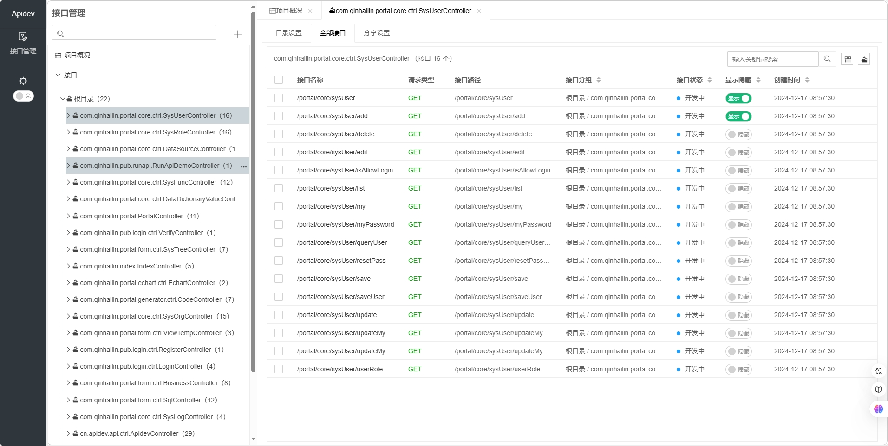
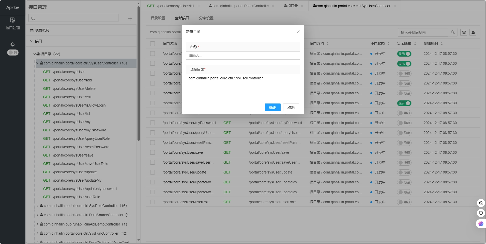
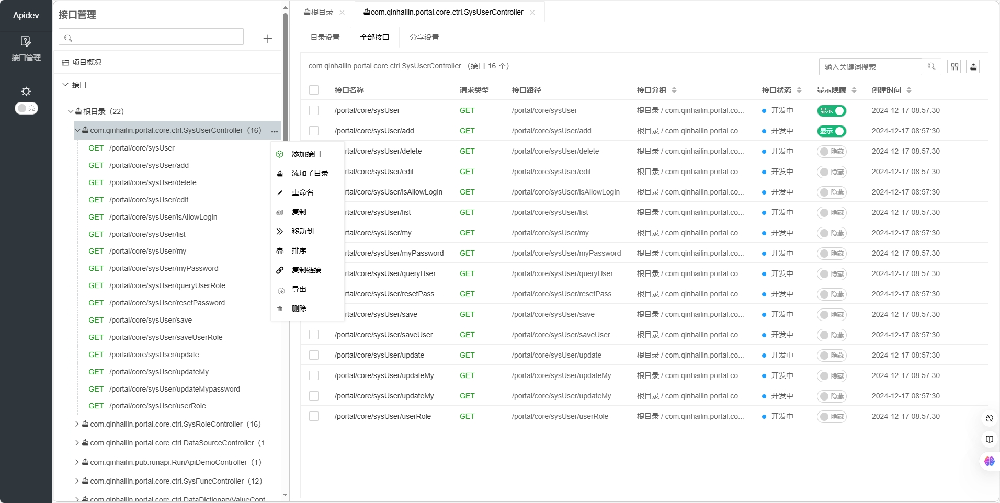
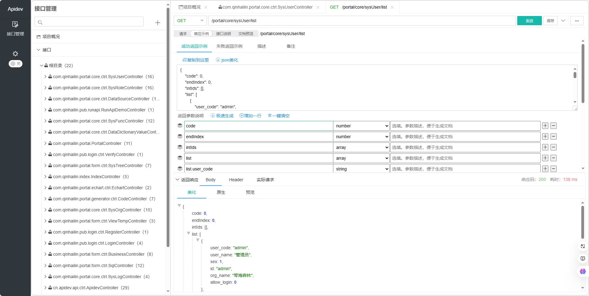
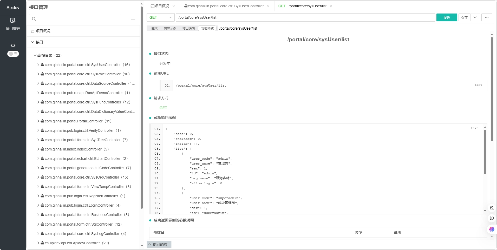
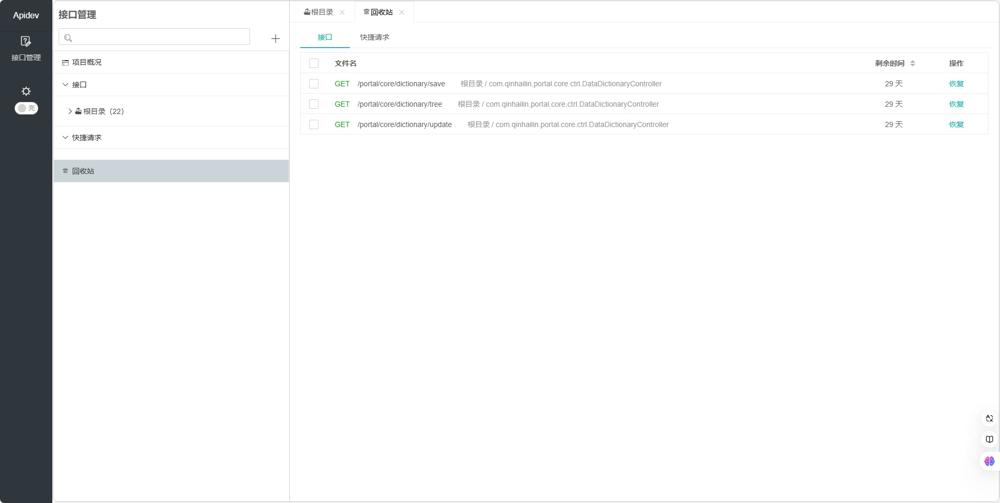

# APIDev  

APIDev is a platform focused on API development and management, designed to provide developers with efficient API solutions and tools.  

Whether you are an experienced senior developer or a novice in the API field, APIDev can be your indispensable assistant, helping you on the road of API development and management.

## contact
APIDev：[http://apidev.cn](http://apidev.cn)

email：qinhaisenlin@163.com


## 一、Installation  

### Maven depend

To use APIDev in your project, add the following Maven dependencies to your 'pom.xml' file:  

```xml  
<dependency>  
    <groupId>cn.apidev</groupId>  
    <artifactId>apidev</artifactId>  
    <version>1.0.3</version>  
</dependency>
```
## 二、Other installation steps
### In the JFinal project configuration steps, the corresponding method configuration code in the main configuration class of JFinalConfig is as follows:
1、Configure APIDev routes:
```
    public void configRoute(Routes me) {
         ...
	// Configure APIDev routes
	ApidevKit.configRoute(me);
    }
```
2、Configure APIDev Engine:
```
    public void configEngine(Engine me) {
	// The configuration APIDev.jar resource directory, which must be placed at the top of the method
	ApidevKit.configEngine(me);
         ...
    }
```
3、onStart prints APIDev information:
```
    public void onStart() {
	// prints APIDev information:
	ApidevKit.onStart();
    }
```
4、在undertow.txt添加以下配置项：
```
#Handle class conversion exceptions
undertow.hotSwapClassPrefix=cn.apidev
#Configure the resource directory of the JAR
undertow.resourcePath = src/main/webapp,classpath:webapp
```
5、Transfer the front-end files of your project from the original src/main/webapp directory to the src/main/resource directory with the folder name webapp:
```
    src/main/resources
	    -webapp
```
6、Create a database table in your project database: apidev_api:

The database file is in the SQL directory of the APIDEV project, and two SQL scripts are temporarily provided: MySQL and Oracle.

7、Optional configuration items: Add the following configuration items to the configuration file of your project:
```
    #1、apidev route configuration, the default is /apidev
     
    apidev.actionKey=/apidev
     
    #2、You can disable the APIDEV service in the production environment
    
    apidev.stop=true
```
8、Startup Project:
If APIDev is successfully started, the following information will be printed: Access route: http://{Project Address}/apidev
```
APIDev Server Info:
 > Start:     true
 > Version:   1.0.3
 > ActionKey: /apidev
```
###  Steps to configure a SpringBoot project:
1、 Start class plus scan directory: cn.apidev, the demo is as follows:
```
@SpringBootApplication(scanBasePackages = {"com.qinhailin", "cn.apidev"})
@EnableTransactionManagement
@EnableScheduling
@Slf4j
public class ApidevApplication extends SpringBootServletInitializer {

    public static void main(String[] args) {
        try {
            SpringApplication.run(ApidevApplication.class, args);
        } catch (Throwable throwable) {
            log.error("The system shuts down abnormally", throwable);
        }
    }

    @Override
    protected SpringApplicationBuilder configure(SpringApplicationBuilder builder) {
        return builder.sources(ApidevApplication.class);
    }
}
```
2、YML configuration database information：spring.datasource.url,spring.datasource.username,spring.datasource.password
```
spring:
  datasource:
    url: 
    username: 
    password: 
```
3、Create a apidev_api table in your project database, and the table creation file is temporarily provided in the SQL directory of the APIDEV project, and two SQL scripts are temporarily provided.

4、If you start a SpringBoot project normally, the following information will be printed when APIDev is successfully started, and the access route will be http://{Project Address}/apidev
```
APIDev Server Info:
 > Start:     true
 > Version:   1.0.3
 > ActionKey: /apidev
```
5、Optional configuration items: Create a apidev-config.txt file in the src/main/resource directory and add the following configuration items:
```
    #1、apidev route configuration, the default is /apidev
     
    apidev.actionKey=/apidev
     
    #2、You can disable the APIDEV service in the production environment
    
    apidev.stop=true
```


## 三、Renderings of the interface
#### 1、APIDev admin homepage, default address：http://localhost/apidev/
Dark theme


#### Bright theme


#### 2、Synchronous interfaces


#### 3、Catalog management page
#### Catalog interface management page


#### A new directory has been added


#### Catalog sharing settings


#### 4、Interface Management page
#### Interface debugging interface


#### Directory tree function menu


#### Sample response


#### Interface documentation


#### Description of the interface


#### 5、Share the link


#### Copy the link


#### Share the page


#### Export the document


#### 6、recycle bin

