# APIDev  

APIDev是一个专注于API开发和管理的平台，旨在为开发者提供高效的API解决方案和工具。  

## 联系
官网地址：[http://apidev.cn](http://apidev.cn)

邮箱：qinhaisenlin@163.com

QQ群：965020683

## 一、安装  

### Maven 依赖  

要在项目中使用 APIDev，请添加以下 Maven 依赖到您的 `pom.xml` 文件中：  

```xml  
<dependency>  
    <groupId>cn.apidev</groupId>  
    <artifactId>apidev</artifactId>  
    <version>1.0.3</version>  
</dependency>
```
## 二、其他安装步骤
### JFinal项目配置步骤，在JFinalConfig主配置类的对应方法配置代码如下：
1、配置APIDev路由：
```
    public void configRoute(Routes me) {
         ...
	// 添加Apidev前端路由
	ApidevKit.configRoute(me);
    }
```
2、配置APIDev模板引擎：
```
    public void configEngine(Engine me) {
	// 配置APIDev.jar资源目录,这行配置必须放在方法的最前面
	ApidevKit.configEngine(me);
         ...
    }
```
3、onStart打印APIDev信息：
```
    public void onStart() {
	// 打印APIDev配置想信息
	ApidevKit.onStart();
    }
```
4、在undertow.txt添加以下配置项：
```
#处理类转换异常问题
undertow.hotSwapClassPrefix=cn.apidev
#配置jar的资源目录
undertow.resourcePath = src/main/webapp,classpath:webapp
```
5、将您自己项目的前端文件由原来的src/main/webapp目录转移到src/main/resource目录下面，文件夹名称为webapp:
```
    src/main/resources
	    -webapp
```
6、在你的项目数据库创建数据库表：apidev_api:

数据库文件在apidev项目的sql目录中,暂时提供了mysql和oracle两个sql脚本。

7、可选配置项：在您项目的配置文件加上下面配置项即可：
```
    #1、Apidev 路由配置，默认是/apidev
     
    apidev.actionKey=/apidev
     
    #2、生产环境可以关闭apidev服务
    
    apidev.stop=true
```
8、启动项目:
APIDev启动成功会打印出如下信息,访问路由：http://{项目地址}/apidev
```
APIDev Server Info:
 > Start:     true
 > Version:   1.0.3
 > ActionKey: /apidev
```
### SpringBoot项目配置步骤：
1、 启动类加上扫描目录：cn.apidev，Demo如下：
```
@SpringBootApplication(scanBasePackages = {"com.qinhailin", "cn.apidev"})
@EnableTransactionManagement
@EnableScheduling
@Slf4j
public class ApidevApplication extends SpringBootServletInitializer {

    public static void main(String[] args) {
        try {
            SpringApplication.run(ApidevApplication.class, args);
        } catch (Throwable throwable) {
            log.error("系统异常关闭", throwable);
        }
    }

    @Override
    protected SpringApplicationBuilder configure(SpringApplicationBuilder builder) {
        return builder.sources(ApidevApplication.class);
    }
}
```
2、yml配置数据库信息：spring.datasource.url,spring.datasource.username,spring.datasource.password
```
spring:
  datasource:
    url: 
    username: 
    password: 
```
3、在您的项目数据库创建apidev_api表，建表文件在apidev项目的sql目录中，暂时提供了mysql和oracle两个sql脚本。

4、正常启动SpringBoot项目，APIDev启动成功会打印出如下信息,访问路由：http://{项目地址}/apidev
```
APIDev Server Info:
 > Start:     true
 > Version:   1.0.3
 > ActionKey: /apidev
```
5、可选配置项：需要在src/main/resource目录创建apidev-conf.txt文件，然后添加如下可以选配置项：
```
    #1、Apidev 路由配置，默认是/apidev
     
    apidev.actionKey=/apidev
     
    #2、生产环境可以关闭apidev服务
    
    apidev.stop=true
```


## 三、界面效果图
#### 1、APIDev管理首页,默认地址：http://localhost/apidev/
暗黑主题
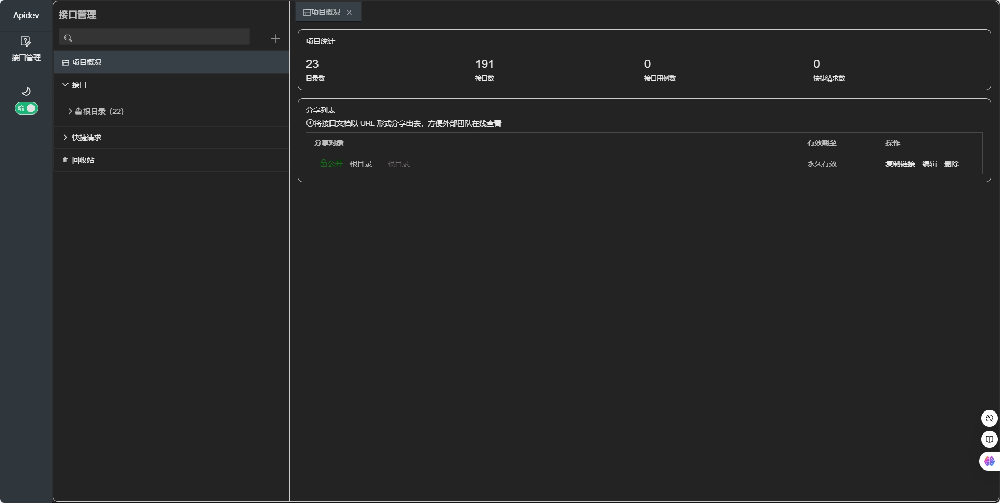

#### 明亮主题
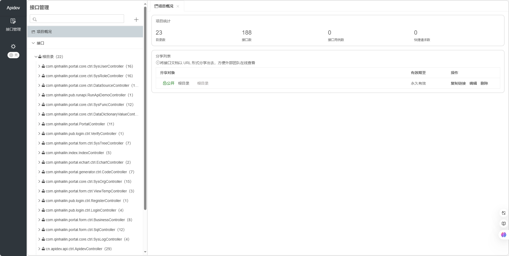

#### 2、同步接口
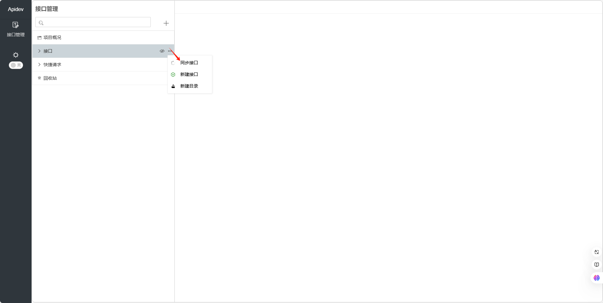

#### 3、目录管理页
#### 目录接口管理页
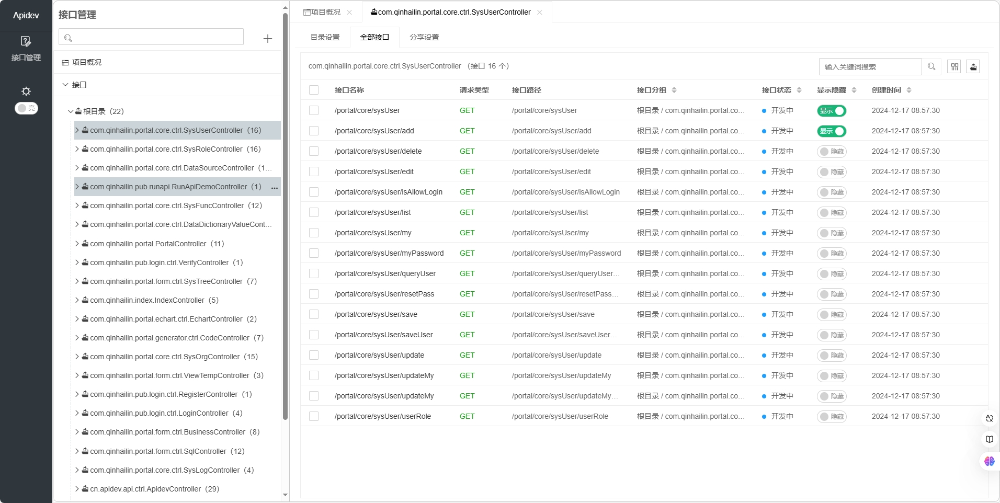

#### 新增目录
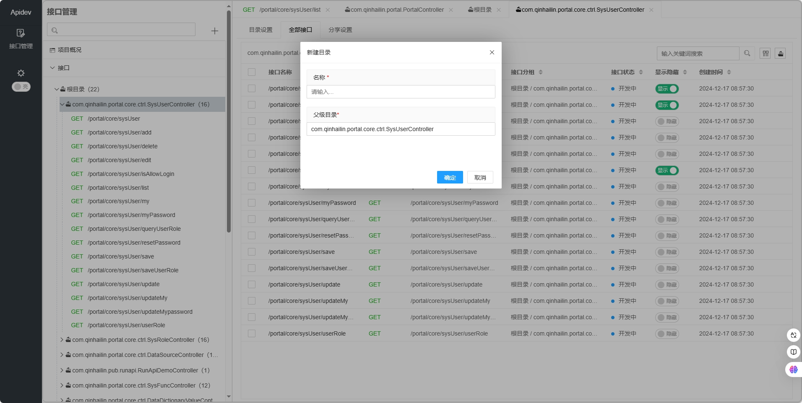

#### 目录分享设置
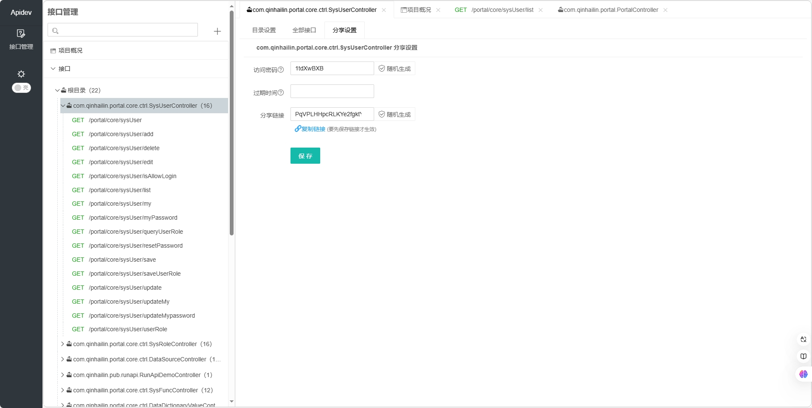

#### 4、接口管理页
#### 接口调试界面
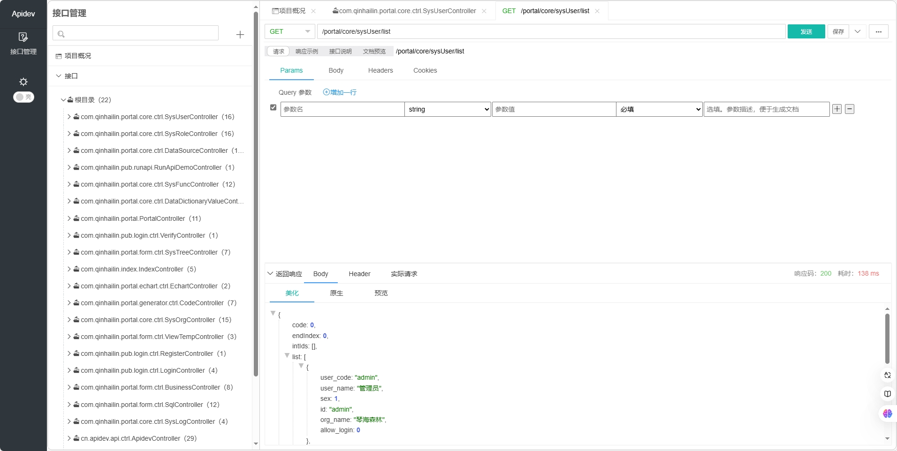

#### 目录树功能菜单
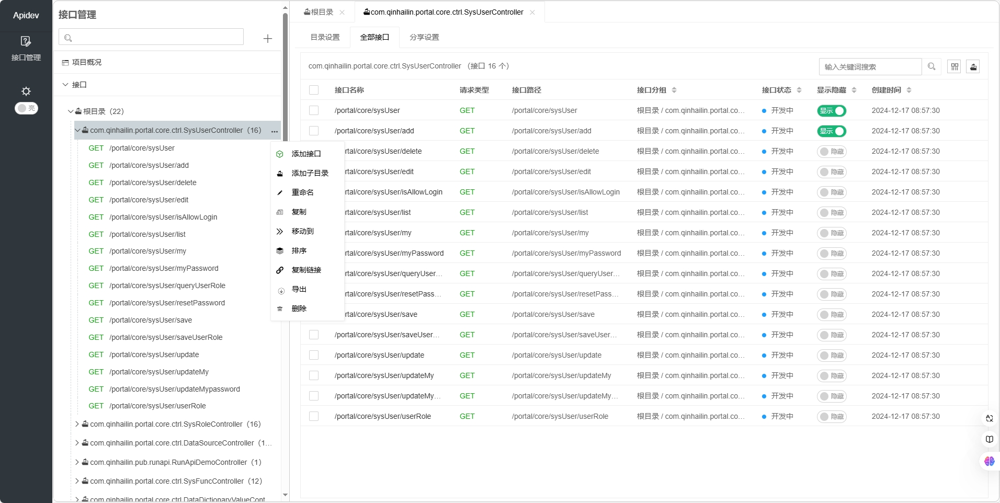

#### 响应示例
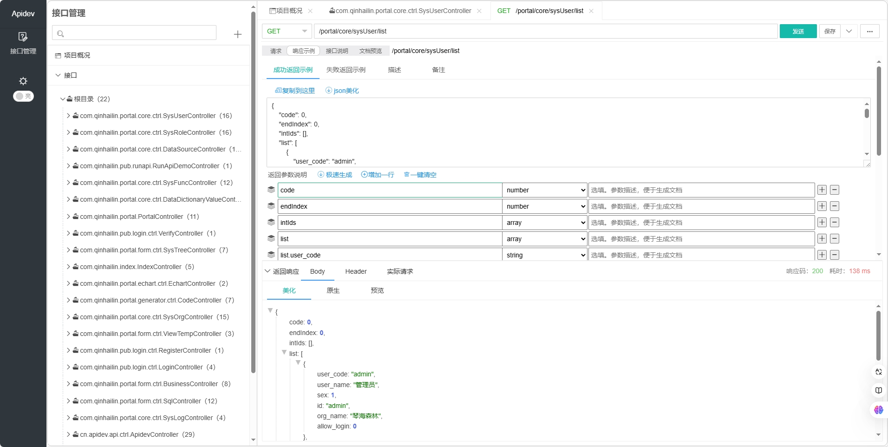

#### 接口文档
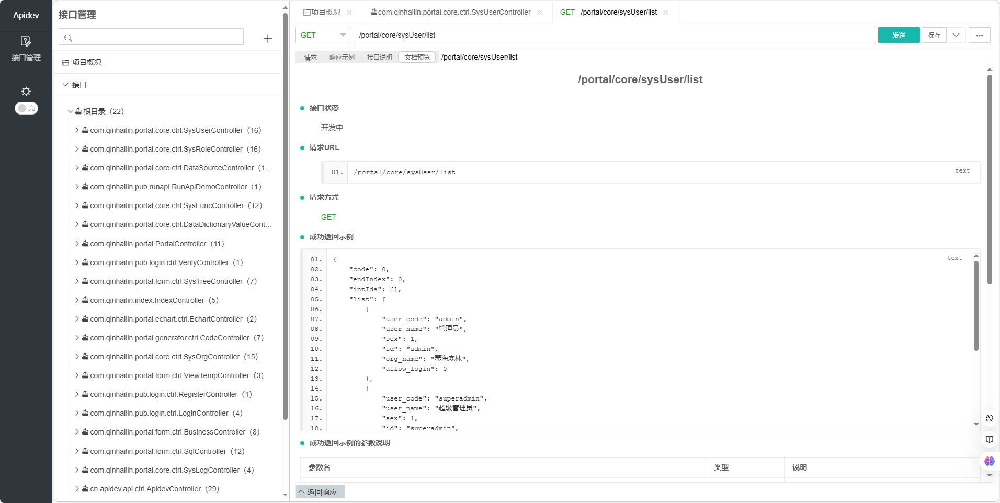

#### 接口说明信息
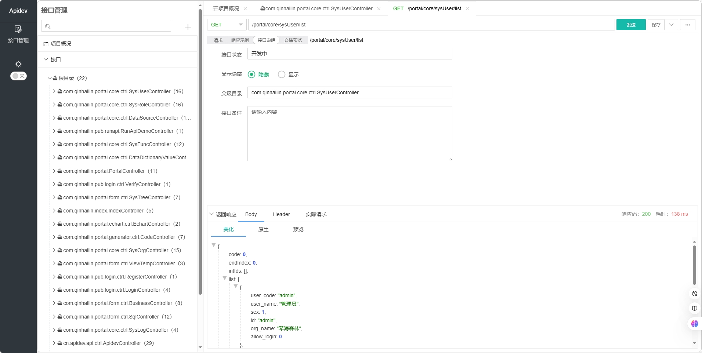

#### 5、分享链接


#### 复制链接
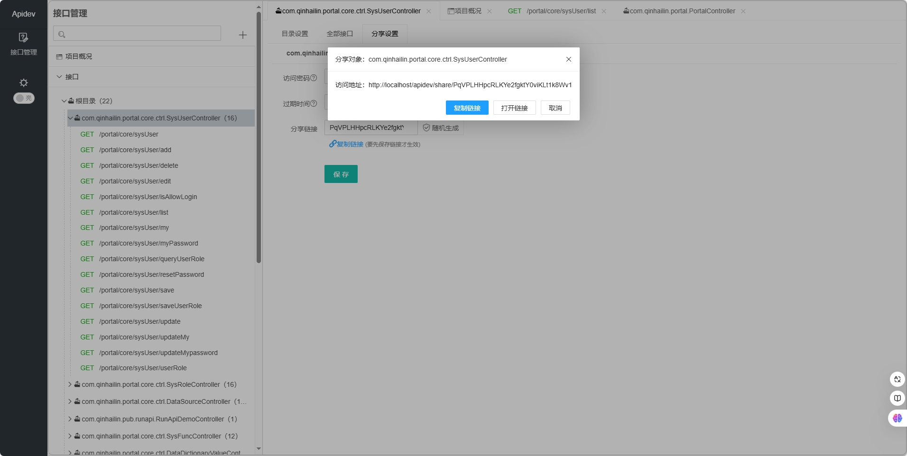

#### 分享地址界面
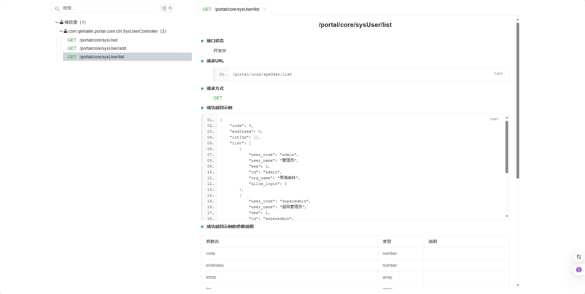

#### 导出文档
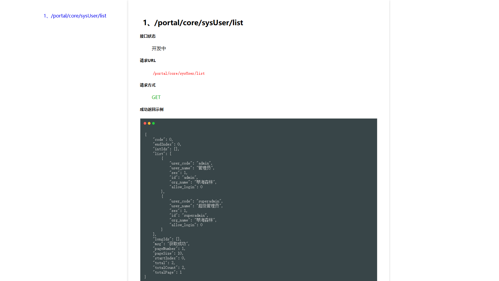

#### 6、回收站
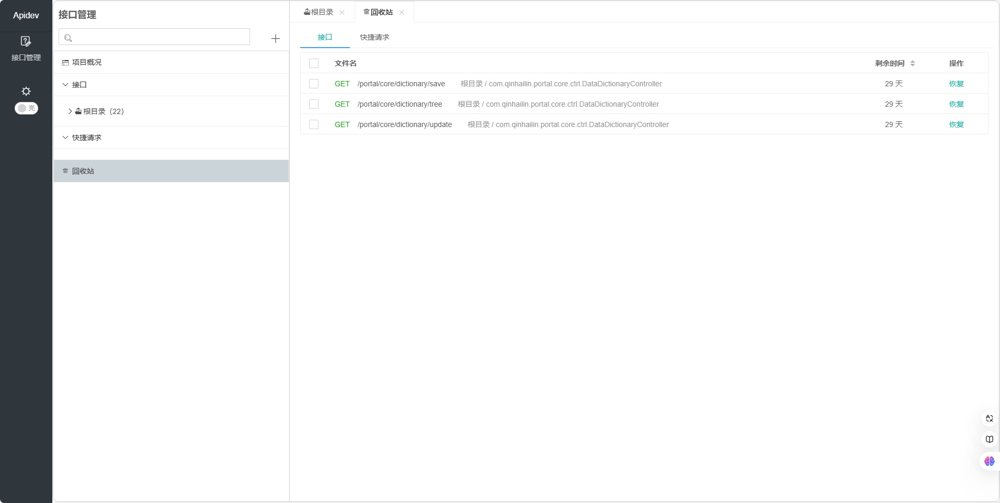


